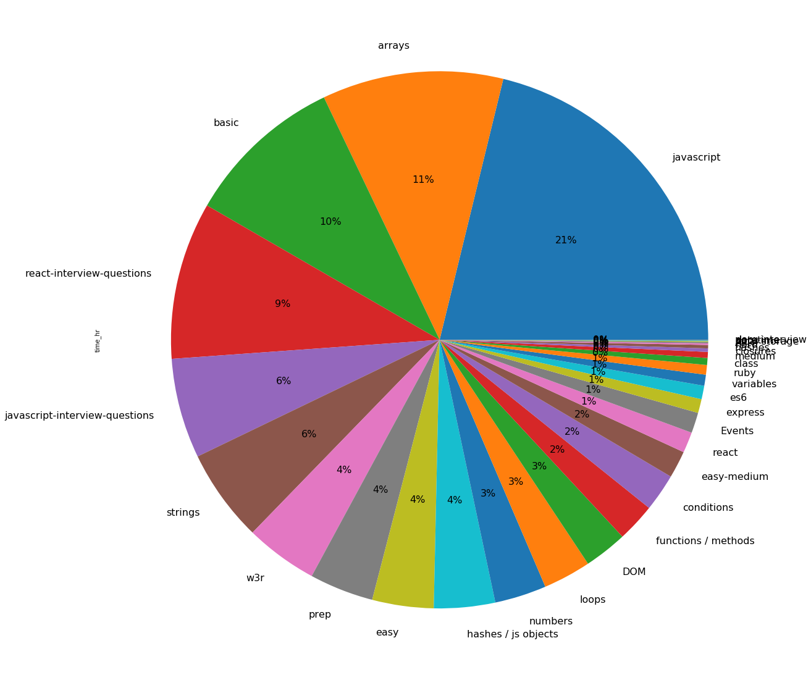

# DCT Academy's Code Platform Analysis - Intersting Insights


```python
import numpy as np
import pandas as pd
import matplotlib.pyplot as plt
import seaborn as sns
import random
import requests
import json
import os
```


```python
API_KEY = os.environ['DCT_CODE_PLATFORM_API_KEY']
```


```python
# Dictionary of all the tables and their columns
table_columns = {}

# Dictionary of all dataframes mapped with table names
df_all = {}

# List of all dataframes of all tables
df_list = []

request_tables = ['submissions', 'assignments', 'tags', 'taggings', 'users']

for table in request_tables:
    url = 'http://code.dctacademy.com/api/v1/ml/data/' + table + '?key=' + API_KEY
    response = requests.get(url)
#     print(response.status_code, response.reason)
    df_all[table] = pd.read_json(response.content)
```


```python
df_all.keys()
```


    dict_keys(['submissions', 'assignments', 'tags', 'taggings', 'users'])


```python
df_all['submissions']['time_hr'] = df_all['submissions']['time_in_seconds'] / 60 / 60 
```


```python
user_submissions = df_all['submissions'] \
    .merge(df_all['assignments'], left_on='assignment_id', right_on='id', suffixes=('_submissions', '_assignments')) \
    .merge(df_all['taggings'], left_on='id_assignments', right_on='taggable_id', suffixes=('_sub_ass', '_taggings')) \
    .merge(df_all['tags'], left_on='tag_id', right_on='id', suffixes=('_sub_ass_tag', '_tags'))
```


```python
user_submissions.columns
```


    Index(['id_submissions', 'statement', 'output', 'user_id_submissions',
           'language', 'assignment_id', 'practice_id', 'created_at_submissions',
           'updated_at_submissions', 'is_checked', 'time_in_seconds', 'pass',
           'fail', 'total', 'points_submissions', 'code_submissions', 'video_url',
           'time_hr', 'id_assignments', 'title', 'body', 'url',
           'created_at_assignments', 'updated_at_assignments',
           'user_id_assignments', 'source', 'is_allowed', 'code_assignments',
           'approved', 'points_assignments', 'minutes', 'function_name',
           'input_size', 'is_front_end', 'display_helper', 'id_sub_ass_tag',
           'tag_id', 'taggable_type', 'taggable_id', 'tagger_type', 'tagger_id',
           'context', 'created_at', 'id_tags', 'name', 'taggings_count'],
          dtype='object')


# Distribution of Assignments


```python
user_submissions.groupby(['name']).count()['time_hr'].sort_values(ascending=False).abs().plot(kind='pie', figsize=(20, 20), autopct='%1.0f%%')
plt.show()
```


# Most Popular Tags


```python
user_submissions['name'] = user_submissions['name'].str.strip().replace('/',',')
user_submissions['name'].value_counts().plot(kind='bar', figsize=(25, 10), color = list('rgbkymc'))
plt.show()
```





* **Javascript**, **Arrays** and **Basics** are the most popular topics
* **React Interview Questions** and **JavaScript Interview Questions** follow

# Top 25 Submissions

## Top 25 Submissions - Number of Assignments Solved


```python
user_submissions['user_id_submissions'].value_counts()[:25].plot(kind='bar', figsize=(25, 10), color = list('rgbkc'))
plt.show()
```


## Top 25 Submissions - Total Time Spent on the Code Platform


```python
user_submissions.groupby(['user_id_submissions']).sum()['time_hr'].sort_values().abs()[:25].plot(kind='bar', figsize=(25, 10), color = list('rgbkc'))
plt.show()
```


## Top 25 Submissions - Total Points Earned on the Code Platform


```python
user_submissions.groupby(['user_id_submissions']).sum()['points_assignments'].sort_values(ascending=False).abs()[:25].plot(kind='bar', figsize=(25, 10), color = list('rgbkc'))
plt.show()
```


```python
df_all['users'][df_all['users']['id'] == 372]
```


<div>
<style scoped>
    .dataframe tbody tr th:only-of-type {
        vertical-align: middle;
    }

    .dataframe tbody tr th {
        vertical-align: top;
    }

    .dataframe thead th {
        text-align: right;
    }
</style>
<table border="1" class="dataframe">
  <thead>
    <tr style="text-align: right;">
      <th></th>
      <th>id</th>
      <th>username</th>
      <th>email</th>
      <th>created_at</th>
      <th>updated_at</th>
      <th>student_id</th>
      <th>allowed_to_log_in</th>
    </tr>
  </thead>
  <tbody>
    <tr>
      <th>354</th>
      <td>372</td>
      <td>Roja V. T</td>
      <td>rojavt9@gmail.com</td>
      <td>2019-11-17 15:00:13.922000+05:30</td>
      <td>2019-12-15 22:15:09.741000+05:30</td>
      <td>371.0</td>
      <td>True</td>
    </tr>
  </tbody>
</table>
</div>


```python
df_all['users'][df_all['users']['id'] == 370]
```


<div>
<style scoped>
    .dataframe tbody tr th:only-of-type {
        vertical-align: middle;
    }

    .dataframe tbody tr th {
        vertical-align: top;
    }

    .dataframe thead th {
        text-align: right;
    }
</style>
<table border="1" class="dataframe">
  <thead>
    <tr style="text-align: right;">
      <th></th>
      <th>id</th>
      <th>username</th>
      <th>email</th>
      <th>created_at</th>
      <th>updated_at</th>
      <th>student_id</th>
      <th>allowed_to_log_in</th>
    </tr>
  </thead>
  <tbody>
    <tr>
      <th>368</th>
      <td>370</td>
      <td>Avinash Kulkarni</td>
      <td>avinashkulkarni1122@gmail.com</td>
      <td>2019-11-13 12:29:51.210000+05:30</td>
      <td>2019-12-31 10:02:30.764000+05:30</td>
      <td>369.0</td>
      <td>True</td>
    </tr>
  </tbody>
</table>
</div>


```python
df_all['users'][df_all['users']['id'] == 36]
```


<div>
<style scoped>
    .dataframe tbody tr th:only-of-type {
        vertical-align: middle;
    }

    .dataframe tbody tr th {
        vertical-align: top;
    }

    .dataframe thead th {
        text-align: right;
    }
</style>
<table border="1" class="dataframe">
  <thead>
    <tr style="text-align: right;">
      <th></th>
      <th>id</th>
      <th>username</th>
      <th>email</th>
      <th>created_at</th>
      <th>updated_at</th>
      <th>student_id</th>
      <th>allowed_to_log_in</th>
    </tr>
  </thead>
  <tbody>
    <tr>
      <th>64</th>
      <td>36</td>
      <td>Pallipati Nagaraju</td>
      <td>pallipatinagaraju@gmail.com</td>
      <td>2018-05-23 12:13:09.647000+05:30</td>
      <td>2019-12-24 21:43:10.139000+05:30</td>
      <td>34.0</td>
      <td>True</td>
    </tr>
  </tbody>
</table>
</div>


# Submission Attempts - Pass


```python
user_submissions['pass'].value_counts().plot(kind='bar', figsize=(20, 10), color = list('rgbkc'))
plt.show()
```


* **3rd and 2nd** are the most popular attempts for passing test cases

# Submission Attempts - Fail


```python
user_submissions['fail'].value_counts().plot(kind='bar', figsize=(20, 10), color = list('rgbkc'))
plt.show()
```


* **1st** is the most popular attempt for failing test cases


```python
user_submissions['created_at_submissions'] = pd.to_datetime(user_submissions['created_at_submissions'].dt.date)
```

# Most Popular Month of Year


```python
user_submissions.groupby([user_submissions['created_at_submissions'].dt.month_name()], sort=False).mean().eval('time_hr').plot(kind='bar', figsize=(20, 10), color = list('rgbkymc'))
plt.show()
```


# Most Popular Day of the Week


```python
user_submissions.groupby([user_submissions['created_at_submissions'].dt.day_name()], sort=False).mean().eval('time_hr').plot(kind='bar', figsize=(20, 10), color = list('rgbkymc'))
plt.show()
```


# Most Popular Hour of the Day


```python
user_submissions['created_at_hr'] = user_submissions['created_at'].dt.hour
```


```python
user_submissions.groupby([user_submissions['created_at_hr']]).mean().eval('time_hr').plot(kind='bar', figsize=(20, 10), color = list('rgbkymc'))
plt.show()
```


